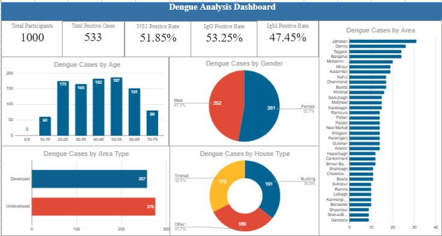
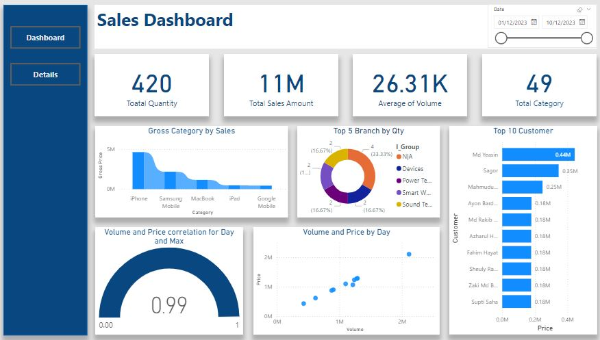
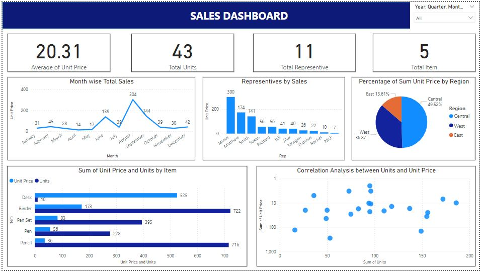
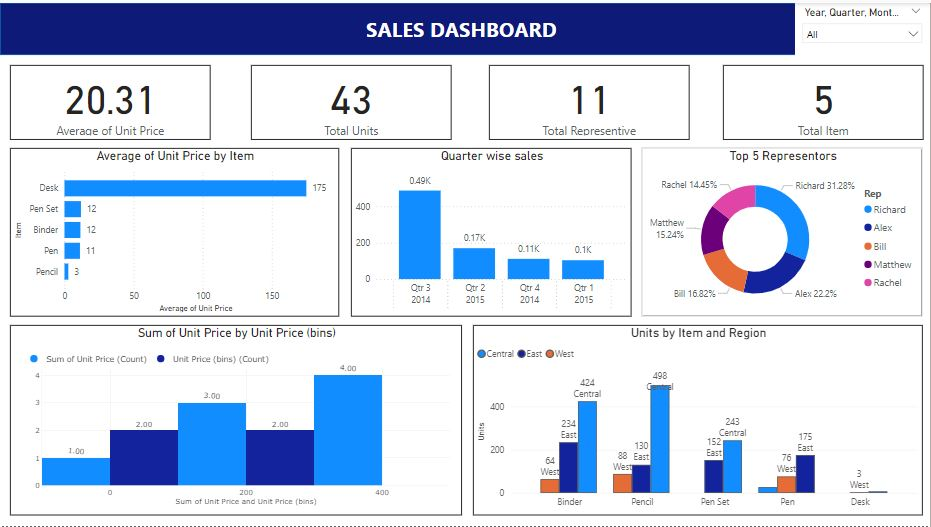
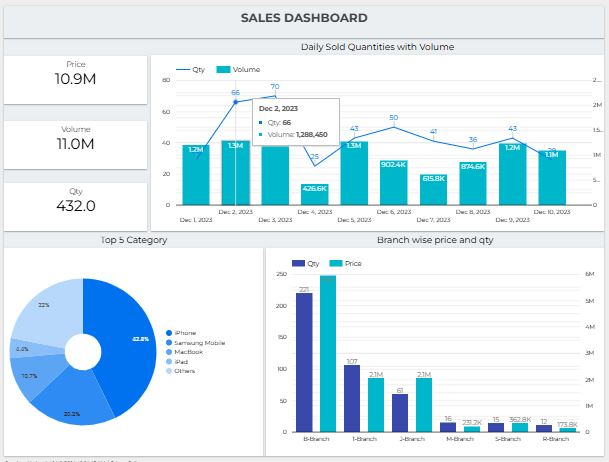

# Power BI Dashboard
## 0. Dengue Analysis Dashboard

# Dashboard Description:
This Dengue Analysis Dashboard offers a detailed breakdown of data related to dengue cases among 1,000 participants.

1. Total Positive Cases: 533, with NS1, IgG, and IgM positivity rates of 51.85%, 53.25%, and 47.45%, respectively.
2. Demographics: Cases are distributed across age groups, with the highest concentration in the 40-49 age range. Gender-wise, males account for 281 cases (52.7%), and females account for 252 cases (47.3%).
3. Geographical Distribution: The dashboard identifies dengue hotspots, with Jauharabad having the highest number of cases.
4. Living Conditions: Cases are categorized by area type (developed vs. underdeveloped) and house type (building, tin-shed, or other), revealing higher incidences in underdeveloped areas and "other" house types.

## 1. Sales Dashboard

# Dashboard Description

This dashboard serves as a comprehensive tool for tracking sales performance. It provides a high-level view of critical metrics, enabling users to quickly identify trends, high-performing products, and valuable customers. With its interactive elements, users can drill down into specific time periods and categories, making it an effective tool for data-driven decision-making. The use of diverse visualizations ensures complex data is presented clearly and intuitively.

# Features

1. Key Performance Indicators (KPIs):
Total Quantity (420): Displays the total number of products sold.
Total Sales Amount (11M): Shows the total revenue generated.
Average of Volume (26.31K): Represents the average sales volume.
Total Category (49): Indicates the total number of product categories.
2. Gross Category by Sales (Bar Chart):
This chart highlights sales distribution across different product categories like iPhone, Samsung Mobile, MacBook, and others.
It provides insights into which products contribute the most to overall sales.
3. Top 5 Branch by Quantity (Donut Chart):
Displays the top 5 branches based on the quantity of products sold.
Each slice represents a branch's share of total sales, allowing quick identification of high-performing locations.
4. Top 10 Customers by Sales (Horizontal Bar Chart):
Lists the top 10 customers ranked by total purchase amount.
Useful for identifying key clients who contribute significantly to the business.
5. Volume and Price Correlation (Scatter Plot):
Plots the relationship between volume and price.
The correlation coefficient of 0.99 indicates a strong positive correlation, suggesting that higher volumes lead to higher pricing or vice versa.
6. Volume and Price by Day (Line Chart):
Tracks the fluctuation of volume and price over time.
This helps in understanding sales trends and identifying peak sales periods.
7. Interactive Date Filter (Slider):
Enables users to select a specific date range for analysis.
This feature allows for time-based insights, such as analyzing sales during a promotional period.
8. Navigation Panel:
Includes buttons like Dashboard and Details for easy navigation between different sections of the report

# Key Features:
- Real-Time Data Insights: The dashboard updates dynamically based on the latest sales data.
- Interactive Filtering: Users can filter data by date range or specific categories for detailed analysis.
- User-Friendly Visuals: Clear and intuitive charts make complex data easy to interpret.
- Correlations and Trends: Provides actionable insights through metrics like correlation coefficient and sales trends over time.

## 2. Order Salse Dashboard 

The Sales Dashboard provides a comprehensive overview of sales performance using multiple visualizations:

1. KPIs: Displays key metrics including the average unit price (20.31), total units sold (43), total representatives (11), and total items (5).
2. Month-wise Total Sales: A line chart showing sales trends across months, highlighting peak performance in July.
3. Representatives by Sales: A bar chart ranking representatives by their total sales, with the top performer achieving 174 units.
4. Percentage of Sum Unit Price by Region: A pie chart indicating regional contribution to total sales—East leads with 49.52%.
5. Sum of Unit Price and Units by Item: A horizontal bar chart comparing the unit price and sales volume for each product category.
6. Correlation Analysis: A scatter plot analyzing the relationship between units sold and unit prices, revealing potential trends.
   
This dashboard offers a clear, data-driven snapshot for quick decision-making.

## 2.1 Order Sales Dashboard 2nd page 

This Sales Dashboard offers a detailed view of performance metrics through various visualizations:

1. KPIs: Key indicators include an average unit price of 20.31, total units sold (43), total representatives (11), and total items (5).
2. Average Unit Price by Item: A bar chart showcasing the average price per item, with the "Desk" category having the highest value.
3. Quarter-wise Sales: A bar chart displaying quarterly sales distribution, with a significant contribution in Q3 2014 (49%).
5. Top 5 Representatives: A donut chart highlighting the top sales performers, with Richard leading (31.28%).
6. Sum of Unit Price by Bins: A histogram representing the count and distribution of unit prices across bins.
7. Units by Item and Region: A clustered bar chart comparing item sales across regions (Central, East, West), showing significant sales for "Pencil" in East.

This dashboard provides valuable insights into sales distribution, representative performance, and regional sales trends.

## 2.2 Order Sales Dashboard (lookerstudio) 2nd page 

## google sheet dashboard  https://docs.google.com/spreadsheets/d/1WawyRHixvEvPI_0xHEMbGzxvio9Zavfr7Drr8dWzOYs/edit?usp=sharing

